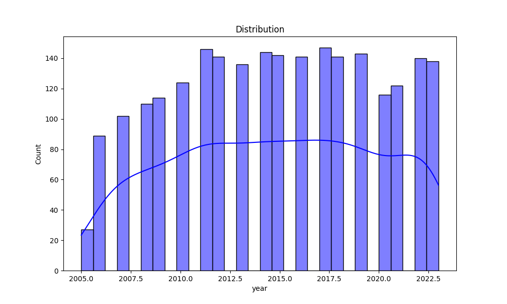

# Automated Data Analysis Report

## Introduction
This is an automated analysis of the dataset, providing summary statistics, visualizations, and insights from the data.

## Summary Statistics
The summary statistics of the dataset are as follows:

| Statistic    | Value |
|--------------|-------|
| year - Mean | 2014.76 |
| year - Std Dev | 5.06 |
| year - Min | 2005.00 |
| year - 25th Percentile | 2011.00 |
| year - 50th Percentile (Median) | 2015.00 |
| year - 75th Percentile | 2019.00 |
| year - Max | 2023.00 |
|--------------|-------|
| Life Ladder - Mean | 5.48 |
| Life Ladder - Std Dev | 1.13 |
| Life Ladder - Min | 1.28 |
| Life Ladder - 25th Percentile | 4.65 |
| Life Ladder - 50th Percentile (Median) | 5.45 |
| Life Ladder - 75th Percentile | 6.32 |
| Life Ladder - Max | 8.02 |
|--------------|-------|
| Log GDP per capita - Mean | 9.40 |
| Log GDP per capita - Std Dev | 1.15 |
| Log GDP per capita - Min | 5.53 |
| Log GDP per capita - 25th Percentile | 8.51 |
| Log GDP per capita - 50th Percentile (Median) | 9.50 |
| Log GDP per capita - 75th Percentile | 10.39 |
| Log GDP per capita - Max | 11.68 |
|--------------|-------|
| Social support - Mean | 0.81 |
| Social support - Std Dev | 0.12 |
| Social support - Min | 0.23 |
| Social support - 25th Percentile | 0.74 |
| Social support - 50th Percentile (Median) | 0.83 |
| Social support - 75th Percentile | 0.90 |
| Social support - Max | 0.99 |
|--------------|-------|
| Healthy life expectancy at birth - Mean | 63.40 |
| Healthy life expectancy at birth - Std Dev | 6.84 |
| Healthy life expectancy at birth - Min | 6.72 |
| Healthy life expectancy at birth - 25th Percentile | 59.20 |
| Healthy life expectancy at birth - 50th Percentile (Median) | 65.10 |
| Healthy life expectancy at birth - 75th Percentile | 68.55 |
| Healthy life expectancy at birth - Max | 74.60 |
|--------------|-------|
| Freedom to make life choices - Mean | 0.75 |
| Freedom to make life choices - Std Dev | 0.14 |
| Freedom to make life choices - Min | 0.23 |
| Freedom to make life choices - 25th Percentile | 0.66 |
| Freedom to make life choices - 50th Percentile (Median) | 0.77 |
| Freedom to make life choices - 75th Percentile | 0.86 |
| Freedom to make life choices - Max | 0.98 |
|--------------|-------|
| Generosity - Mean | 0.00 |
| Generosity - Std Dev | 0.16 |
| Generosity - Min | -0.34 |
| Generosity - 25th Percentile | -0.11 |
| Generosity - 50th Percentile (Median) | -0.02 |
| Generosity - 75th Percentile | 0.09 |
| Generosity - Max | 0.70 |
|--------------|-------|
| Perceptions of corruption - Mean | 0.74 |
| Perceptions of corruption - Std Dev | 0.18 |
| Perceptions of corruption - Min | 0.04 |
| Perceptions of corruption - 25th Percentile | 0.69 |
| Perceptions of corruption - 50th Percentile (Median) | 0.80 |
| Perceptions of corruption - 75th Percentile | 0.87 |
| Perceptions of corruption - Max | 0.98 |
|--------------|-------|
| Positive affect - Mean | 0.65 |
| Positive affect - Std Dev | 0.11 |
| Positive affect - Min | 0.18 |
| Positive affect - 25th Percentile | 0.57 |
| Positive affect - 50th Percentile (Median) | 0.66 |
| Positive affect - 75th Percentile | 0.74 |
| Positive affect - Max | 0.88 |
|--------------|-------|
| Negative affect - Mean | 0.27 |
| Negative affect - Std Dev | 0.09 |
| Negative affect - Min | 0.08 |
| Negative affect - 25th Percentile | 0.21 |
| Negative affect - 50th Percentile (Median) | 0.26 |
| Negative affect - 75th Percentile | 0.33 |
| Negative affect - Max | 0.70 |
|--------------|-------|

## Missing Values
The following columns contain missing values, with their respective counts:

| Column       | Missing Values Count |
|--------------|----------------------|
| Country name | 0 |
| year | 0 |
| Life Ladder | 0 |
| Log GDP per capita | 28 |
| Social support | 13 |
| Healthy life expectancy at birth | 63 |
| Freedom to make life choices | 36 |
| Generosity | 81 |
| Perceptions of corruption | 125 |
| Positive affect | 24 |
| Negative affect | 16 |

## Outliers Detection
The following columns contain outliers detected using the IQR method (values beyond the typical range):

| Column       | Outlier Count |
|--------------|---------------|
| year | 0 |
| Life Ladder | 2 |
| Log GDP per capita | 1 |
| Social support | 48 |
| Healthy life expectancy at birth | 20 |
| Freedom to make life choices | 16 |
| Generosity | 39 |
| Perceptions of corruption | 194 |
| Positive affect | 9 |
| Negative affect | 31 |

## Correlation Matrix
Below is the correlation matrix of numerical features, indicating relationships between different variables:

## Outliers Visualization
This chart visualizes the number of outliers detected in each column:

## Distribution of Data
Below is the distribution plot of the first numerical column in the dataset:

## Conclusion
The analysis has provided insights into the dataset, including summary statistics, outlier detection, and correlations between key variables.
The generated visualizations and statistical insights can help in understanding the patterns and relationships in the data.

## Data Story
Based on the data analysis, here is a creative narrative that interprets the findings in an engaging and detailed manner:

## Story
**Title: The Tapestry of Happiness: A Journey Through the Years**

**Introduction**

In a world constantly in flux, where the tides of life bring both joy and sorrow, understanding the essence of happiness and well-being has become an essential quest. This quest transcends borders, cultures, and generations. A recent analysis of global happiness data from 2005 to 2023 offers a compelling glimpse into the factors that shape our emotional landscapes. Through a detailed examination of life satisfaction, social support, economic factors, and emotional health, we uncover not just statistics, but stories of triumph, struggle, and the relentless pursuit of joy.

**Body**

As we delve into the heart of the dataset, we encounter the Life Ladder—a metaphor for the varying stages of happiness across different nations and years. The average score of 5.48, with a minimum of 1.28 and a maximum of 8.02, paints a vivid picture of a world grappling with its emotional well-being. The steady rise in life satisfaction from 2011 to 2019, where scores climbed from 4.64 to 6.32, hints at a burgeoning optimism during those years. Yet, as the world faced unprecedented challenges in 2020 and beyond, the fluctuations in this ladder remind us that happiness is not a linear journey; it is often a dance between the highs and lows of life.

The correlation matrix reveals intriguing connections, particularly between social support and negative affect. With a correlation of -0.45, it suggests that as social support increases, negative feelings tend to diminish. This insight underscores the importance of community and relationships in fostering emotional resilience. In societies where people feel connected and supported, the burden of life's challenges becomes lighter, illuminating the power of empathy and camaraderie.

Economically, the Log GDP per capita provides another layer of understanding. While wealth does not guarantee happiness, the data shows a weak positive correlation of 0.08 with life satisfaction. This suggests that while financial stability plays a role in our well-being, it is not the sole determinant. The true richness of life, as the analysis suggests, often springs from intangible sources such as love, purpose, and freedom—the very things that cannot be quantified in dollars.

Moreover, the presence of outliers in the dataset serves as a reminder that individual experiences can diverge dramatically from the average. The two outliers in Life Ladder scores prompt us to consider the unique stories behind these numbers—perhaps tales of resilience in the face of adversity or the extraordinary circumstances that elevate some lives above the fray. Each data point represents a human story, a narrative woven into the larger tapestry of global well-being.

**Conclusion**

As we step back from the labyrinth of numbers and correlations, we find ourselves reflecting on the lessons gleaned from this analysis. Happiness is not merely a statistic; it is a complex interplay of various factors, including social support, economic stability, and personal freedom. The data encourages us to cultivate our communities, nurture our relationships, and prioritize emotional health as we navigate the unpredictable waters of life.

In conclusion, the journey through the years of happiness reminds us that while the world may present challenges, it also offers opportunities for growth, connection, and joy. By embracing the multifaceted nature of well-being, we can strive to climb our own Life Ladders, supporting one another as we reach for the heights of happiness. And perhaps, in doing so, we can help others find their footing on the rungs of life, creating a brighter, more joyful future for all.
