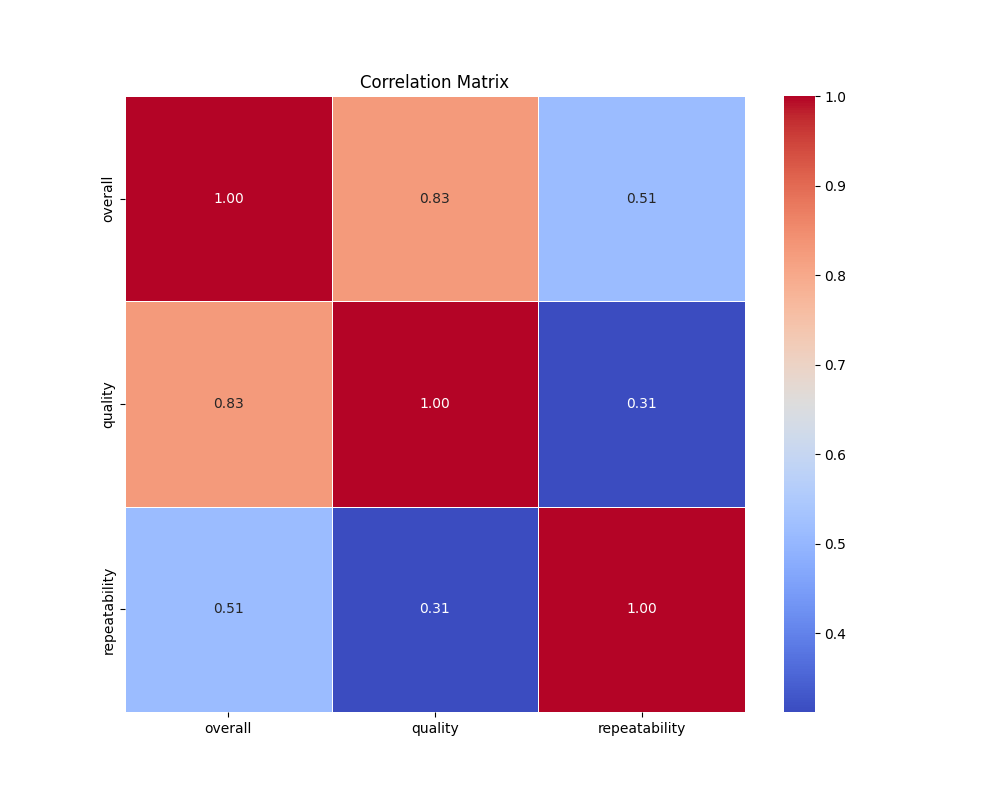
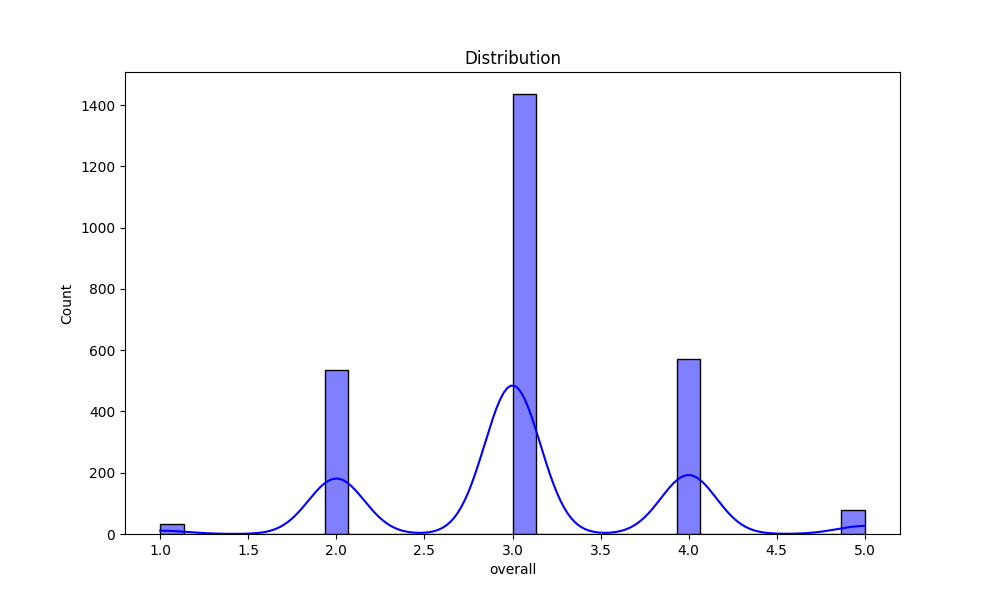

# Automated Data Analysis Report

## Introduction
This is an automated analysis of the dataset, providing summary statistics, visualizations, and insights from the data.

## Summary Statistics
The summary statistics of the dataset are as follows:

| Statistic    | Value |
|--------------|-------|
| overall - Mean | 3.05 |
| overall - Std Dev | 0.76 |
| overall - Min | 1.00 |
| overall - 25th Percentile | 3.00 |
| overall - 50th Percentile (Median) | 3.00 |
| overall - 75th Percentile | 3.00 |
| overall - Max | 5.00 |
|--------------|-------|
| quality - Mean | 3.21 |
| quality - Std Dev | 0.80 |
| quality - Min | 1.00 |
| quality - 25th Percentile | 3.00 |
| quality - 50th Percentile (Median) | 3.00 |
| quality - 75th Percentile | 4.00 |
| quality - Max | 5.00 |
|--------------|-------|
| repeatability - Mean | 1.49 |
| repeatability - Std Dev | 0.60 |
| repeatability - Min | 1.00 |
| repeatability - 25th Percentile | 1.00 |
| repeatability - 50th Percentile (Median) | 1.00 |
| repeatability - 75th Percentile | 2.00 |
| repeatability - Max | 3.00 |
|--------------|-------|

## Missing Values
The following columns contain missing values, with their respective counts:

| Column       | Missing Values Count |
|--------------|----------------------|
| date | 99 |
| language | 0 |
| type | 0 |
| title | 0 |
| by | 262 |
| overall | 0 |
| quality | 0 |
| repeatability | 0 |

## Outliers Detection
The following columns contain outliers detected using the IQR method (values beyond the typical range):

| Column       | Outlier Count |
|--------------|---------------|
| overall | 1216 |
| quality | 24 |
| repeatability | 0 |

## Correlation Matrix
Below is the correlation matrix of numerical features, indicating relationships between different variables:

## Outliers Visualization
This chart visualizes the number of outliers detected in each column:

## Distribution of Data
Below is the distribution plot of the first numerical column in the dataset:

## Conclusion
The analysis has provided insights into the dataset, including summary statistics, outlier detection, and correlations between key variables.
The generated visualizations and statistical insights can help in understanding the patterns and relationships in the data.

## Data Story
Based on the data analysis, here is a creative narrative that interprets the findings in an engaging and detailed manner:

## Story
**Title: The Tale of the Quality Quest**

**Introduction**

In the vibrant village of Data Valley, nestled between the rolling hills of Statistics and the shimmering lakes of Analysis, lived a curious community of analysts and number-crunchers. This village was unlike any other, for its inhabitants held a unique belief: that every number told a story. One day, a wise elder named Professor Metrics decided to embark on a quest to uncover the truths hidden within a freshly gathered dataset. This dataset, filled with information about quality assessments and repeatability scores, held the potential to transform their understanding of the world around them.

**The Journey Begins**

With a glint of excitement in his eyes, Professor Metrics gathered a group of young analysts, eager to explore the dataset that contained 2,652 entries. “Today,” he proclaimed, “we shall uncover the essence of quality and repeatability!” As they delved into the data, they discovered that the average quality score hovered at a modest 3.2, while the overall rating settled at 3.0. However, the villagers noted that the standard deviation of 0.76 suggested a wide variety of experiences. Some villagers rated their experiences as low as 1, while others celebrated them with a perfect score of 5.

Amidst the numbers, the analysts learned that quality had a strong correlation with the overall score, indicated by a robust coefficient of 0.83. It became evident that those who rated their experiences highly in quality often mirrored that sentiment in their overall assessments. Yet, as they dug deeper, they discovered another layer of complexity: a repeatability score that averaged at 1.49, indicating that many experiences had not been repeated, perhaps due to their ephemeral nature.

**The Call for Reflection**

As the sun dipped below the horizon, casting a golden glow over Data Valley, the analysts found themselves pondering the implications of their findings. “What makes an experience high quality?” one young analyst named Clara mused. “Is it the initial thrill, or is it the ability to relive that moment again and again?” Her question lingered in the air, prompting a spirited discussion among the group.

With 1,216 entries marked as outliers in the overall score, the villagers speculated about the extremes. Were these outliers mere anomalies, or did they represent extraordinary experiences that deserved to be celebrated? They realized that understanding these high scores could lead to valuable insights into what truly captivated their community. The analysts also noted that quality, with only 24 outlier entries, seemed more consistent and less prone to wild swings, suggesting a foundation of reliability in their assessments.

**Conclusion: Lessons from the Quest**

As twilight enveloped Data Valley, Professor Metrics gathered his young analysts around a flickering lantern. “What we have uncovered today is a tapestry of experiences,” he said. “While the numbers give us a glimpse into the villagers' sentiments, it is our duty to interpret these tales with care. The high correlations reveal the significance of quality, but we must also respect the unique voices of those whose experiences diverge from the norm.”

The quest had taught them that the essence of quality is not only in its measurement but also in the narratives that emerge from it. The villagers would soon host a festival to celebrate both the ordinary and the extraordinary, encouraging everyone to share their stories, whether they were rated a humble 1 or a glorious 5. In Data Valley, they learned that every score, every experience, and every tale was worth telling. With this newfound wisdom, they set forth to create a community that valued quality, repeatability, and the rich tapestry of life that numbers could only begin to illustrate.
